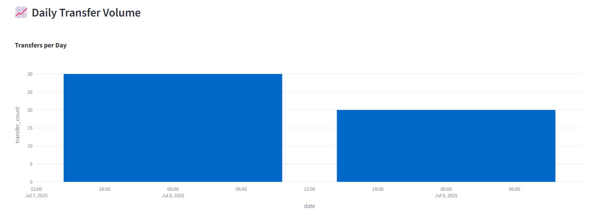
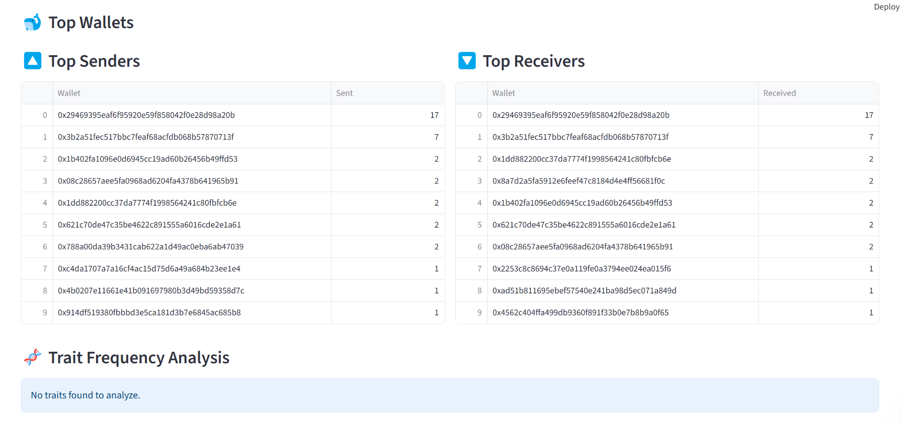

 🖼️ NFT Collection Analytics Dashboard

Analyze top NFT collections with real-time stats:

    📉 Floor Price Trends

    🐋 Whale Movements

    🧬 Rarity Distribution

    👤 Ownership Breakdown

    🔁 Transfer Activity

    📊 Daily Volume Analytics

    🧪 Raw Metadata Viewer

⚡ Powered By

    🧠 Moralis API – NFT metadata, transfers, traits

    🔍 OpenSea API – Floor price & collection stats

    📊 Streamlit – UI and interactivity

    📈 Plotly – Rich visualizations

    🐍 Python & Pandas – Data wrangling and ETL






 🌍 Live Demo

[Click here to explore the dashboard](https://your-name-nft-dashboard.streamlit.app)

🔧 How to Run

```bash
pip install -r requirements.txt
streamlit run app.py
