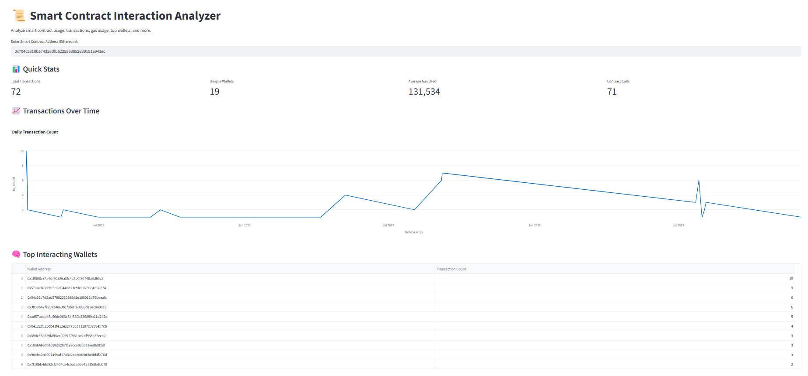

🧠 Smart Contract Interaction Analyzer

This dashboard allows you to analyze how a smart contract is used across Ethereum.

 🔍 Features
- 📈 Daily transaction trends
- ⛽ Average gas usage
- 👛 Unique wallets interacting
- 🧠 Top senders by transaction count
- 📦 Powered by Etherscan API and Streamlit




⚙️ Tech Stack
- Streamlit
- Web3.py
- Plotly
- Etherscan API
- Python & Pandas

---

🚀 How to Run

```bash
pip install -r requirements.txt
streamlit run app.py
