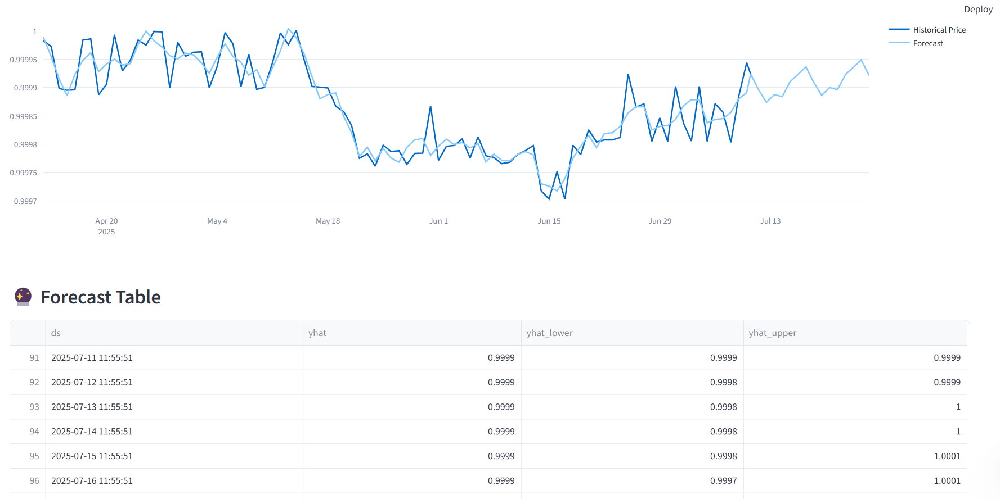

📈 Token Price / TVL Predictor (ML Model)

Forecast the future price or Total Value Locked (TVL) of any crypto token using time-series machine learning models.  
Built with [Streamlit](https://streamlit.io/), [Prophet](https://facebook.github.io/prophet/), and real-time data from CoinGecko.

---

🔍 Features

- 🔗 Fetch historical token price or protocol TVL (90-day window)
- 🧠 Train forecasting model with [Prophet](https://facebook.github.io/prophet/)
- 📈 Visualize historical + predicted trends using Plotly
- 🧮 Adjustable forecast range (7–30 days)
- 📊 Forecast confidence intervals (`yhat_lower`, `yhat_upper`)
- 🔄 Real-time token selection from dropdown list

---

🛠️ Tech Stack

| Layer        | Stack                                 |
| ------------ | ------------------------------------- |
| 🖥 Frontend   | Streamlit + Plotly                    |
| 📊 ML Model  | Prophet (time-series forecasting)     |
| 📦 Data API  | CoinGecko `/market_chart` API         |
| 📁 Backend   | Python + Pandas                       |

---

💾 Example Tokens

- `ethereum`
- `uniswap`
- `aave`
- `usd-coin`

> You can replace with any token supported by CoinGecko’s `/coins/{id}/market_chart` endpoint.

---
🔗 [Live Demo](https://price-predict.streamlit.app)





🚀 How to Run Locally

1️⃣ Clone the Repo

```bash
git clone https://github.com/objemmanuel/web3-data-analyst-portfolio.git
cd web3-data-analyst-portfolio/05-token-price-predictor
