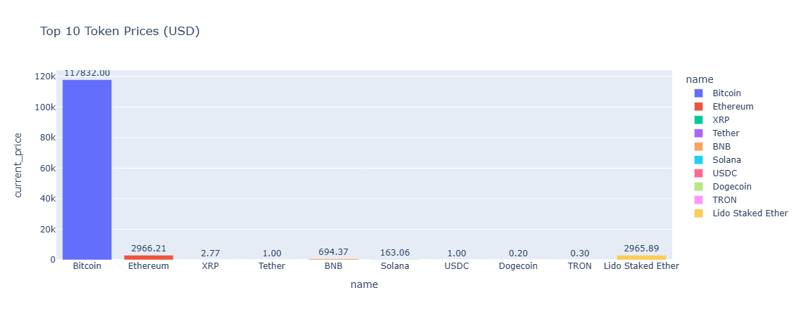
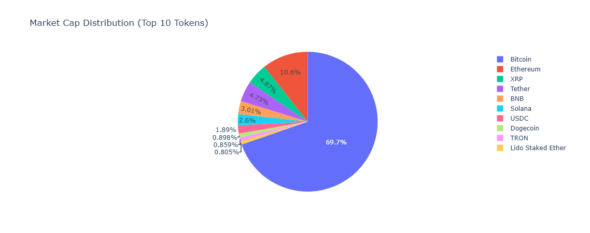
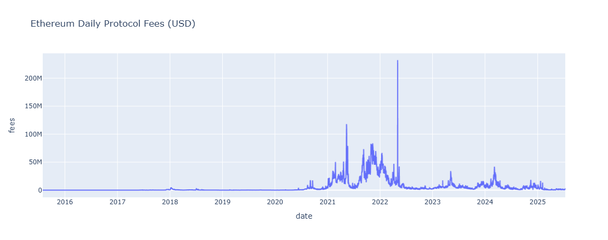

# 🧾 State of the Chain – Blockchain Analytics Report

A monthly on-chain data report that analyzes protocol metrics, token prices, and fee usage using public blockchain APIs.

---

## 🔍 Features

- 💸 Ethereum daily protocol fees (via DeFiLlama)
- 🪙 Top 10 tokens by market cap, price, and volume (via CoinGecko)
- 📈 Interactive charts using Plotly
- 🧠 Summary insights in Markdown
- 📁 Exportable as PDF or HTML

---

## 🛠️ Tech Stack

| Category      | Tools Used                             |
| ------------- | -------------------------------------- |
| Data Source   | CoinGecko API, DeFiLlama API           |
| Processing    | Python, Pandas, JSON                   |
| Visualization | Plotly, Jupyter Notebook               |
| Report        | Markdown (within notebook)             |
| Deployment    | Run locally or export to HTML/PDF      |

---

## 📸 Screenshots

> Screenshots from `report_generator.ipynb`





---

## 🚀 How to Run

1. Clone this repo and navigate to the project:

```bash
git clone https://github.com/objemmanuel/web3-data-analyst-portfolio.git
cd web3-data-analyst-portfolio/06-state-of-the-chain

2. Install dependencies:
pip install pandas plotly notebook

3. Fetch the latest data:
python fetch_data.py


4. Open the Jupyter notebook:
jupyter notebook report_generator.ipynb

5. Run all cells and export to PDF/HTML if needed.