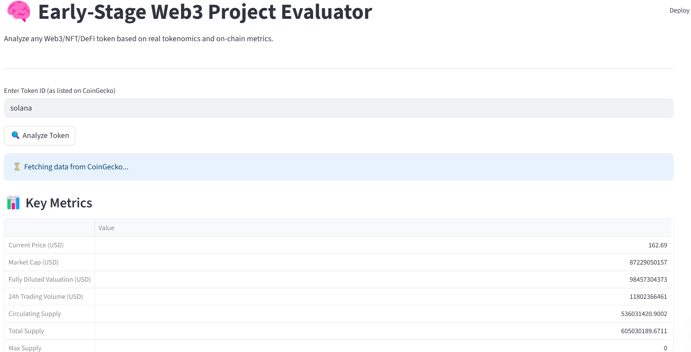
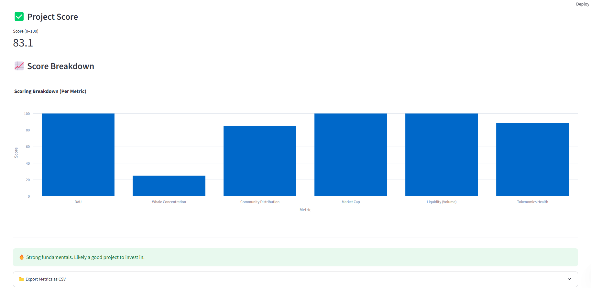

# 🔍 Early-Stage Web3 Project Evaluator

Analyze early-stage Web3/NFT/DeFi tokens based on real on-chain activity, tokenomics, liquidity, and holder distribution using just the CoinGecko Token ID.

This tool helps investors, analysts, and founders assess project health and investment potential using live data — no need to manually search for contract addresses!

---

## 📊 Key Features

- ✅ **Token ID Only Input** – Automatically fetches metrics using just CoinGecko Token ID
- 📈 **Key Metrics Analyzed**:
  - Daily Active Wallets (DAU) – estimated from token supply
  - Market Cap
  - Current Price
  - 24h Trading Volume
  - Fully Diluted Valuation (FDV)
  - Circulating Supply / Total Supply
  - Max Supply
  - All-Time High / Low
  - Whale Holders % (estimated)
  - Community Holders % (estimated)
- 🎯 **Scoring System**:
  - Calculates a score (0–100) based on:
    - On-chain activity
    - Liquidity
    - Distribution
    - Tokenomics health
- 📉 **Breakdown Chart** for visualizing individual metric impact
- 📁 **Export to CSV** – One-click download of raw metrics

---

## 🧪 Sample Tokens

Test the app using these token IDs from CoinGecko:

| Token Name | Token ID |
|------------|-----------|
| Uniswap    | `uniswap` |
| Aave       | `aave`    |
| Chainlink  | `chainlink` |
| Synthetix  | `havven`  |
| 1inch      | `1inch`   |

---

## 🧠 How It Works

- Uses [CoinGecko API](https://www.coingecko.com/en/api) to fetch all token metrics live.
- Estimates DAU from circulating supply.
- Approximates whale and community concentration.
- Normalizes each metric and assigns scores.
- Aggregates into an overall project health score.

---

## 🖼️ Screenshot




---

## 🛠️ Tech Stack

| Component       | Stack                          |
|----------------|---------------------------------|
| Frontend       | Streamlit, Plotly               |
| Backend        | Python                          |
| Data Source    | CoinGecko API                   |
| Visualization  | Plotly, Streamlit Metrics       |
| Deployment     | Streamlit Cloud / GitHub Pages  |

---

## 🚀 How to Run Locally

```bash
git clone https://github.com/objemmanuel/web3-data-analyst-portfolio.git
cd web3-data-analyst-portfolio/07-early-project-evaluator

# Install dependencies
pip install -r requirements.txt

# Run the Streamlit app
streamlit run app.py
