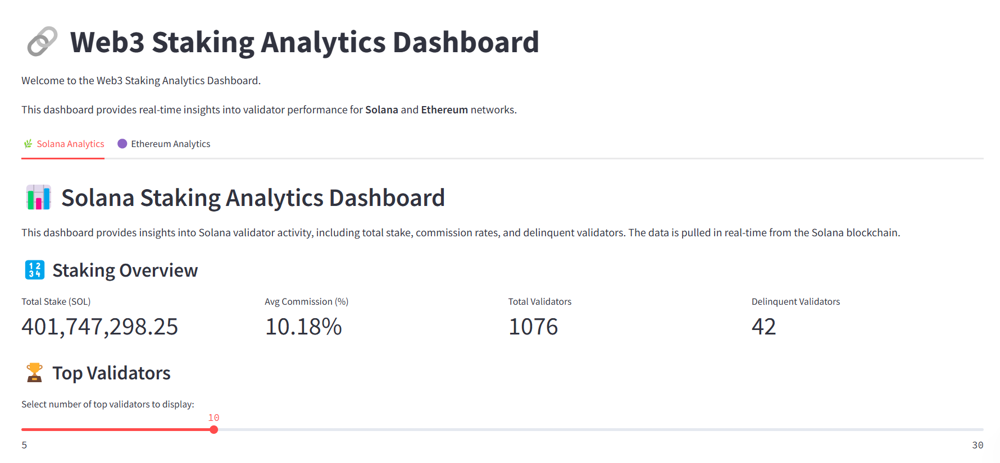
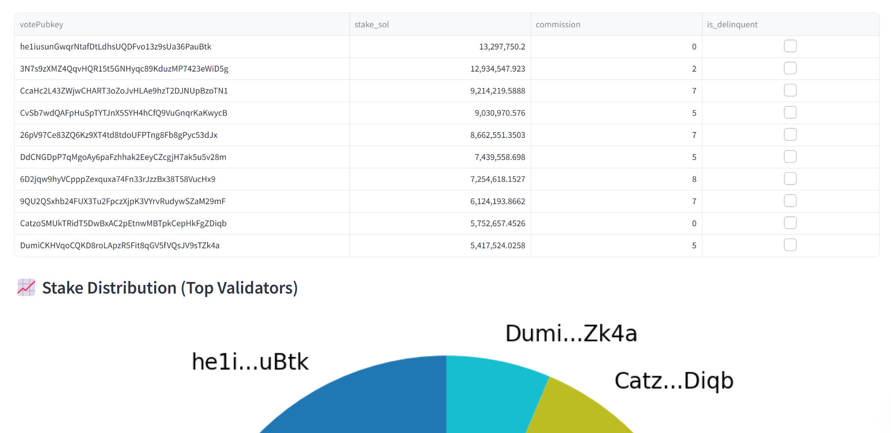
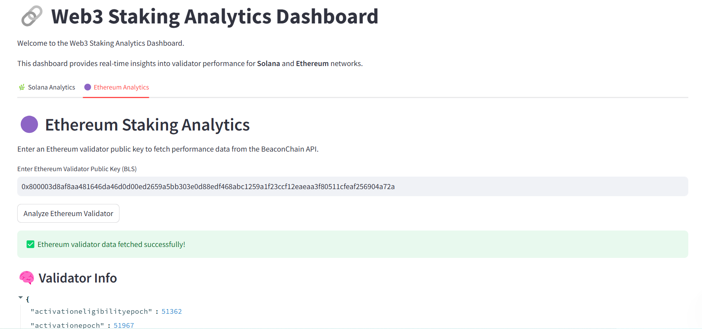

# 📊 Staking Analytics Dashboard (Solana & Ethereum)

A real-time dashboard built with **Streamlit** that provides deep insights into **Solana** and **Ethereum** staking validators.

This project fetches on-chain staking data from both networks, processes validator performance metrics, and visualizes them in a clean, interactive dashboard.

---


## 🔍 Features

### ✅ Solana
- Total Stake in SOL
- Average Commission Rate
- Total & Delinquent Validators
- Top Validator Rankings
- Stake Distribution Pie Chart
- Commission Rate Bar Chart
- Real-time RPC Integration

### ✅ Ethereum
- Total Validators Online
- Active Stake (ETH)
- Missed Attestations
- Validator Performance Summary
- Top Performing Validators
- BLS Key Lookup
- BeaconChain API Integration

---

## 🖼️ Screenshots

### Solana Dashboard  



### Ethereum Dashboard  


---

## 🚀 Live Demo

🔗 [View Solana & Ethereum Staking Analytics Dashboard](https://staking-analytics.streamlit.app/) 

---

🧠 Data Sources

    Solana RPC API (via https://api.mainnet-beta.solana.com)

    Ethereum BeaconChain API (https://beaconcha.in/api)

    (Optional) Custom BLS validator inputs for Ethereum

## 🛠 Installation

### 📁 Clone the Repository

```bash
git clone https://github.com/yourusername/web3-data-analyst-portfolio.git
cd web3-data-analyst-portfolio/08-staking-analytics
