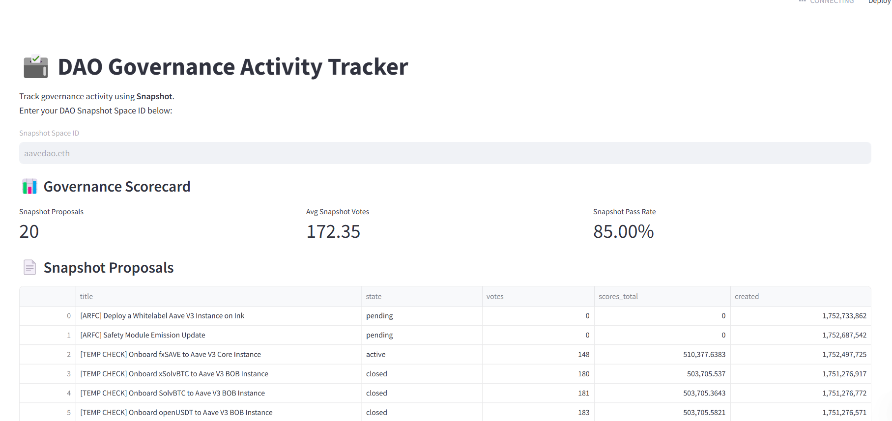

# 🗳️ DAO Governance Activity Tracker

A simple and interactive Streamlit dashboard that tracks DAO governance activity using [Snapshot](https://snapshot.org). Enter your DAO's Snapshot Space ID to view proposals, voting trends, and governance engagement statistics.

> Built for web3 data analysts, governance researchers, and DAO participants.

---

## 🔍 Features

- 🔹 View the latest **Snapshot proposals**
- 📊 See **average votes**, **proposal pass rate**, and **activity trends**
- 📅 Visualize proposal **volume over time**
- ⚙️ Fully powered by **GraphQL** APIs from Snapshot

---

## 🚀 Demo

👉 **Live App**: [Visit Live Demo](https://dao-governance.streamlit.app)

---

## 📷 Screenshots

### 🏠 Dashboard Overview



---

## 🛠️ Tech Stack

| Tool         | Purpose                          |
|--------------|----------------------------------|
| `Streamlit`  | Web app framework (Python)       |
| `Pandas`     | Data processing                  |
| `Matplotlib` | Chart/graph visualization        |
| `GraphQL`    | Querying Snapshot proposals      |
| `Snapshot`   | DAO governance data              |

---

## 🧰 Setup Instructions

1. **Clone the repo:**

   ```bash
   git clone https://github.com/yourusername/dao-governance-tracker.git
   cd dao-governance-tracker
