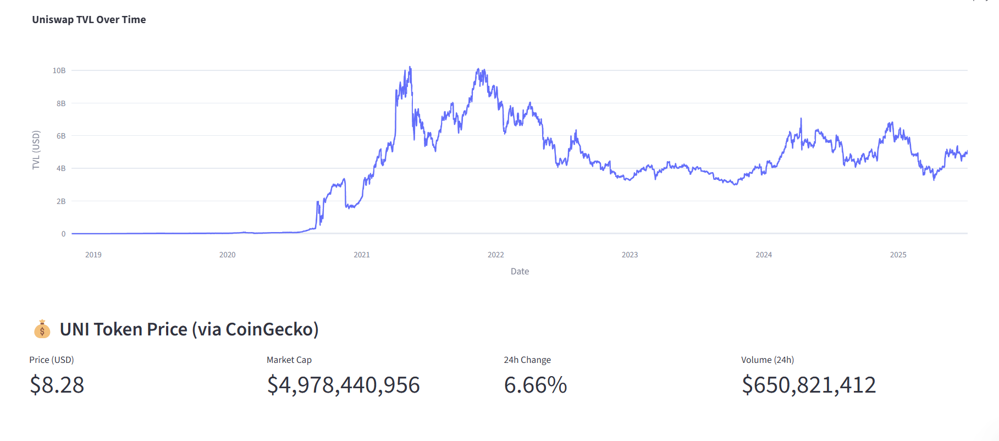
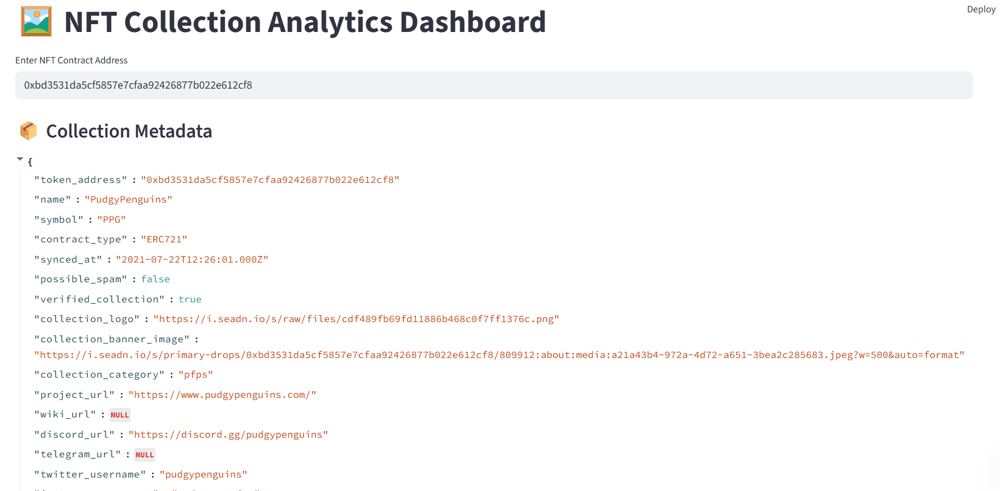

 📊 Web3 Data Analyst Portfolio

A collection of 10 real-world Web3-focused data analytics projects — including dashboards, machine learning models, on-chain metrics, and DeFi/NFT analytics — built using Python, Streamlit, Web3 APIs, and blockchain data platforms.

> 🚀 Each project is production-ready and suitable for portfolios, job interviews, freelance gigs, or startup MVPs.

---

🧠 Projects Overview

| # | Project Title | Description | Tech Stack | Status |
|--|----------------|-------------|------------|--------|
| 1️⃣ | [Real-Time DeFi Protocol Dashboard](./01-defi-dashboard) | Track TVL, token price, wallet activity, and swap volume across protocols like Uniswap, Aave, and Curve. | Python, Streamlit, Covalent, Plotly | ✅ Completed |
| 2️⃣ | [NFT Collection Analytics Dashboard](./02-nft-dashboard) | Analyze floor price, owner concentration, whale movements, and rarity for top NFT collections. | Moralis, OpenSea API, Pandas, Streamlit | ✅ Completed |
| 3️⃣ | [Smart Contract Interaction Analyzer](./03-smart-contract-analyzer) | Monitor how smart contracts are used — gas usage, wallet diversity, frequency. | Etherscan API, Web3.py, Plotly | ✅ Completed |
| 4️⃣ | Token Flow & Whale Tracker | Visualize token movement across wallets and detect large whale behaviors. | NetworkX, Etherscan, Python | 🔜 Coming Soon |
| 5️⃣ | Token Price / TVL Prediction ML Model | Forecast token metrics using time-series models. | XGBoost, Prophet, sklearn | 🔜 Coming Soon |
| 6️⃣ | “State of the Chain” Report Generator | Generate monthly blockchain intelligence reports with trend analysis. | Jupyter, Markdown, LaTeX | 🔜 Coming Soon |
| 7️⃣ | Early-Stage Project Metrics Evaluator | Score early DeFi/NFT projects by DAU, TVL, tokenomics, growth. | Dune, Excel, Custom Scoring | 🔜 Coming Soon |
| 8️⃣ | Staking Pool & Validator Analytics | Analyze staking behavior, validator distribution, and trends. | Subgraphs, RPC Nodes, SQL | 🔜 Coming Soon |
| 9️⃣ | DAO Governance Tracker | Visualize DAO proposals, voting patterns, and top voters. | Snapshot API, The Graph, Tally | 🔜 Coming Soon |
| 🔟 | Blockchain Data ETL Pipeline | Clean and normalize data from APIs, RPCs, and subgraphs. | Airflow, Postgres, Web3.py | 🔜 Coming Soon |

---

 🛠️ Tools & APIs Used

- **Languages**: Python, SQL
- **Dashboards**: Streamlit, Plotly, Dash
- **Data Sources**: Covalent, Moralis, The Graph, Etherscan, Dune, OpenSea, Subgraphs
- **Machine Learning**: XGBoost, Prophet, scikit-learn
- **ETL / Pipelines**: Airflow, PostgreSQL
- **Blockchain Platforms**: Ethereum, Solana, Polygon

| Category         | Stack                                        |
| ---------------- | -------------------------------------------- |
| 📊 Frontend      | Streamlit, Plotly, Dash                      |
| 🔗 Web3 APIs     | Moralis, Covalent, OpenSea, Tally, Etherscan |
| 🧠 ML & Forecast | XGBoost, Prophet, Scikit-learn               |
| 🧱 Data Stack    | Python, Pandas, SQL, Dune                    |
| 📦 ETL Pipelines | Airflow, The Graph, Web3.py                  |
| 💻 Deployment    | GitHub, Streamlit Cloud                      |

---

📸 Demo Screenshots





---

🌐 Live Demos (Coming Soon)

| Project | Demo Link |
|--------|------------|
| 1️⃣ Real-Time DeFi Dashboard | [Streamlit App](https://01-defi-dashboard.streamlit.app) |
| 2️⃣ NFT Analytics Dashboard | [Streamlit App](https://nft-dashboard.streamlit.app) |
| 3️⃣ Smart Contract Analyzer | [Streamlit App](https://contractanalyzer.streamlit.app) |

> You can deploy your own versions to Streamlit Cloud or Hugging Face Spaces for free.

---
💡 Why This Portfolio?

This repository is structured to:

    🧠 Prove deep understanding of on-chain data

    📈 Visualize blockchain trends in real-time

    📊 Support investment or DAO decisions with data

🔗 Author & Contacts

Built by Obiajulu Emmanuel
Open to Web3 data gigs & smart contract analytics work.

    GitHub: github.com/objemmanuel

    LinkedIn: linkedin.com/in/obiajulu-emmanuel-609170234

    Email: objemmanuel2000@gmail.com


📁 How to Use Locally

Clone the repo:

```bash
git clone https://github.com/objemmanuel/web3-data-analyst-portfolio.git
cd web3-data-analyst-portfolio
