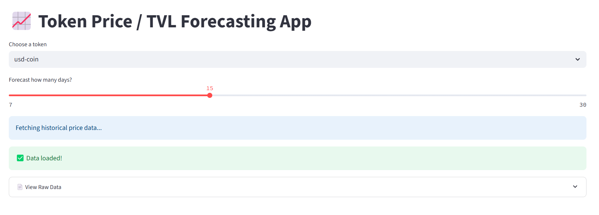

# 📊 Web3 Data Analyst Portfolio

A collection of 10 real-world Web3-focused data analytics projects — including dashboards, machine learning models, on-chain metrics, and DeFi/NFT analytics — built using Python, Streamlit, Web3 APIs, and blockchain data platforms.


---

## 🧠 Projects Overview

| #   | Project Title                                           | Description                                                                                         | Tech Stack                                | Status         |
|-----|--------------------------------------------------------|-----------------------------------------------------------------------------------------------------|--------------------------------------------|----------------|
| 1️⃣ | [Real-Time DeFi Protocol Dashboard](./01-defi-dashboard)         | Track TVL, token price, wallet activity, and swap volume across protocols like Uniswap, Aave, and Curve. | Python, Streamlit, Covalent, Plotly         | ✅ Completed    |
| 2️⃣ | [NFT Collection Analytics Dashboard](./02-nft-dashboard)          | Analyze floor price, owner concentration, whale movements, and rarity for top NFT collections.         | Moralis, OpenSea API, Pandas, Streamlit     | ✅ Completed    |
| 3️⃣ | [Smart Contract Interaction Analyzer](./03-smart-contract-analyzer) | Monitor how smart contracts are used — gas usage, wallet diversity, frequency.                        | Etherscan API, Web3.py, Plotly              | ✅ Completed    |
| 4️⃣ | [Token Flow & Whale Tracker](./04-token-flow-tracker)            | Visualize token movement across wallets and detect large whale behaviors.                            | NetworkX, Etherscan, Python, Streamlit      | ✅ Completed    |
| 5️⃣ | [Token Price / TVL Prediction ML Model](./05-token-price-predictor) | Forecast token metrics using time-series models (Prophet, Plotly).                                  | Prophet, scikit-learn, Plotly, Streamlit    | ✅ Completed    |
| 6️⃣ | “State of the Chain” Report Generator                    | Generate monthly blockchain intelligence reports with trend analysis.                                | Jupyter, Markdown, LaTeX                   | 🔜 Coming Soon |
| 7️⃣ | Early-Stage Project Metrics Evaluator                    | Score early DeFi/NFT projects by DAU, TVL, tokenomics, retention, and growth.                        | Dune, Excel, Custom Scoring                 | 🔜 Coming Soon |
| 8️⃣ | Staking Pool & Validator Analytics                       | Analyze staking behavior, validator distribution, and trends.                                        | Subgraphs, RPC Nodes, SQL                  | 🔜 Coming Soon |
| 9️⃣ | DAO Governance Tracker                                   | Visualize DAO proposals, voting patterns, and top voters across DAOs.                                | Snapshot, The Graph, Tally API              | 🔜 Coming Soon |
| 🔟 | Blockchain Data ETL Pipeline                             | Clean and normalize blockchain data from APIs, RPC nodes, and subgraphs.                            | Web3.py, Airflow, PostgreSQL                | 🔜 Coming Soon |

---

## 🛠️ Tools & APIs Used

- **Languages**: Python, SQL
- **Dashboards**: Streamlit, Plotly, Dash
- **Data Sources**: Covalent, Moralis, The Graph, Etherscan, Dune, OpenSea, Subgraphs
- **Machine Learning**: XGBoost, Prophet, scikit-learn
- **ETL / Pipelines**: Airflow, PostgreSQL
- **Blockchain Platforms**: Ethereum, Solana, Polygon

| Category         | Stack                                        |
| ---------------- | -------------------------------------------- |
| 📊 Frontend      | Streamlit, Plotly, Dash                      |
| 🔗 Web3 APIs     | Moralis, Covalent, OpenSea, Tally, Etherscan |
| 🧠 ML & Forecast | XGBoost, Prophet, Scikit-learn               |
| 🧱 Data Stack    | Python, Pandas, SQL, Dune                    |
| 📦 ETL Pipelines | Airflow, The Graph, Web3.py                  |
| 💻 Deployment    | GitHub, Streamlit Cloud                      |

---

## 📸 Demo Screenshots

> You can replace these with real images from the `images/` folders of each project:




---

## 🌐 Live Demos

| Project                        | Demo Link (Replace with yours)                         |
|-------------------------------|--------------------------------------------------------|
| 1️⃣ DeFi Protocol Dashboard     | [Streamlit App](https://01-defi-dashboard.streamlit.app)       |
| 2️⃣ NFT Analytics Dashboard     | [Streamlit App](https://nft-dashboard.streamlit.app)           |
| 3️⃣ Smart Contract Analyzer     | [Streamlit App](https://contractanalyzer.streamlit.app)        |
| 4️⃣ Token Whale Tracker         | [Streamlit App](https://track-token.streamlit.app)            |
| 5️⃣ Token Forecast ML App       | [Streamlit App](https://token-forecast.streamlit.app)          |


---

## 💡 Why This Portfolio?

This repository is structured to:

- 🧠 Prove deep understanding of on-chain data and smart contract behavior  
- 📈 Visualize blockchain and DeFi/NFT trends in real time  
- 🧮 Apply ML to forecast protocol growth and price performance  
- 📊 Support investment and governance decisions with data  

---

## 👨‍💻 Author & Contact

Built by **Obiajulu Emmanuel**  
Open to Web3 data gigs & smart contract analytics work.

- GitHub: [github.com/objemmanuel](https://github.com/objemmanuel)  
- LinkedIn: [linkedin.com/in/obiajulu-emmanuel-609170234](https://linkedin.com/in/obiajulu-emmanuel-609170234)  
- Email: objemmanuel2000@gmail.com  

---

## 📁 How to Use Locally

```bash
# Clone the repository
git clone https://github.com/objemmanuel/web3-data-analyst-portfolio.git
cd web3-data-analyst-portfolio

# Enter a project folder
cd 01-defi-dashboard

# Install dependencies
pip install -r requirements.txt

# Run the Streamlit app
streamlit run app.py
